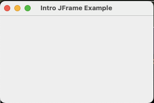
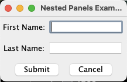

# JavaGUIExamples
This is a quick introduction to Java Swing, one of the Graphical User Interface (GUI) libraries in Java. The various visual classes are defined in package `javax.swing`. 

Many of the examples are inspired by the official Java tutorials: https://docs.oracle.com/javase/tutorial/uiswing/.

## Creating and showing a window in Java



The following code

* creates a window (defined by class `javax.swing.JFrame`)
* sets its minimum size
* sets it to quit the program when you click the close button
* packs its contents (currently nothing) according to whatever layout choices you've made
* shows it by setting its visibility to `true`

```java
JFrame frame = new JFrame("Intro JFrame Example");
frame.setMinimumSize(new java.awt.Dimension(300, 200));
frame.setDefaultCloseOperation(JFrame.EXIT_ON_CLOSE);
frame.pack();
frame.setVisible(true);
```

There's a bit of magic that needs to happen related to security and threading. We won't have the tools to explain this until a few weeks from now, but we need to tell Java to create and show the window like this:

```java
SwingUtilities.invokeLater(() -> {
    whatever code you want executed
});
```
Read the complete example here: [MainFrame.java](src%2FMainFrame.java)

## Java Swing visual components


The window to the right has the following components:

* `First Name:` and `Last Name:` are defined by class `JLabel` (so you would import `javax.swing.JLabel` to use one)
* The text fields are defined by class `JTextField`
* `Submit` and `Cancel` are defined by class `JButton`

There are containers called `JPanel`s. They can be oriented horizontally (the default) or vertically, and they contain other components. You can use them to organize your user interface.

* `First Name:` and its `JTextField` are in a `JPanel`
* `Last Name:` and its `JTextField` are in a `JPanel`
* The two buttons are in a `JPanel`
* Those 3 `JPanel`s are together inside another `JPanel`. We'll call this the main panel.

The whole window is defined by class `JFrame`. The enclosing `JPanel` goes in the _content pane_ of the `JFrame`.

Here we create the first name `JLabel` and `JTextField` and add them to a `JPanel`:
```java
    JPanel firstNamePanel = new JPanel();
    firstNamePanel.add(new JLabel("First Name:"));
    firstNamePanel.add(new JTextField(10));
```
By default, `JPanel` contents flow left to right. You can set a `JPanel` to display its contents vertically instead. Here, we create the main `JPanel`, set its layout to vertical (on the Y axis), and add the three nested `JPanel`s.
```java
    JPanel mainPanel = new JPanel();
    mainPanel.setLayout(new BoxLayout(mainPanel, BoxLayout.Y_AXIS));
    mainPanel.add(firstNamePanel);
    mainPanel.add(lastNamePanel);
    mainPanel.add(buttonPanel);
```

It isn't all that pretty, but it's simple, and you can use nested `JPanel`s to quickly organize your user interface.

Make sure you read and understand the complete example: [NestedPanelsExample.java](src%2FNestedPanelsExample.java).

## Handling button clicks


When any user event happens (a button click, typing in a text field), Java creates an _event object_ and then calls a method that you specify. The method you write is called an _event listener_.

Recall the `Submit` button:

```java
JButton submit = new JButton("Submit");
```

Here, we tell the button to call method `actionPeformed`:

```java
submit.addActionListener(new ActionListener() {
    @Override
    public void actionPerformed(ActionEvent e) {
        String firstName = firstNameField.getText();
        String lastName = lastNameField.getText();
        JOptionPane.showMessageDialog(null, "Hello " + firstName + " " + lastName);
    }
});
```
Button methods are always called `actionPerformed`. There are other listener methods for other kinds of components that we'll encounter later.

Again, we won't yet have the terminology to explain this fully, but it's actually defining a class! The `new ActionListener() { … }` part creates an anonymous (nameless) class that contains one method, `actionPerformed`.

Notice that the `actionPeformed` method gets the text out of the first and last name `JTextField`s. You can
can access the local variables declared in the enclosing method! That means that its enclosing scope must include the enclosing method's local variables.

This is so weird and fun.

When you run it, you'll see a popup window. `JOptionPane.howMessageDialog` does this.

Make sure you read and understand the example: [ButtonClickExample.java](src%2FButtonClickExample.java)

As an exercise, add an action listener to the `Cancel` button that clears the text fields by calling method `setText`. You'll need to start by refactoring the cancel button code:

Old:
```java
buttonPanel.add(new JButton("Cancel"));
```

New:
```java
JButton cancel = new JButton("Cancel");
buttonPanel.add(cancel);
```

Now you can call `cancel.addActionListener` just like you did for `submit`.

When you run it, try entering some text into the name fields and clicking `Cancel`. It should clear the text fields.

## Further reading

You can visit here for different ways to organize your user interface: https://docs.oracle.com/javase/tutorial/uiswing/layout/visual.html

We recommend using nested `JPanel`s with `BoxLayout`s. This isn't a user experience course! We're not grading you on how nice your UI looks!